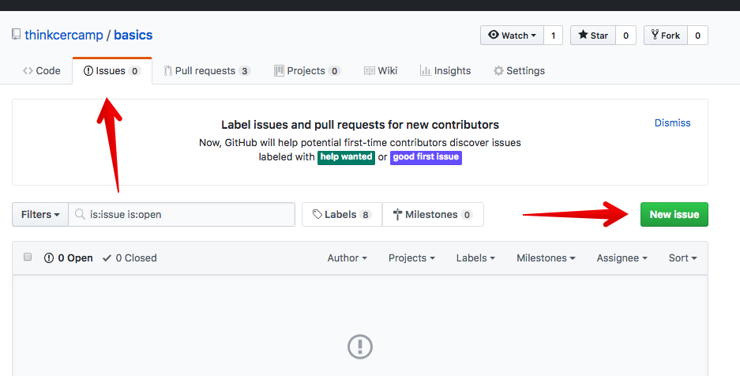

ThinkCERCAMP
========================================================================================

# Purpose
To create a space to learn web development skills, for learners of all experience levels.

# How it works
This repository is structured with learning modules. Each of the modules is designed to be completed independently. We recommend starting with Module 0, but you are free to start whereever you'd like. Modules 0-3 are designed to walk you through building out an online portfolio hosted on GitHub Pages.
Each Friday at 12pm Central time we will provide a space for you to work through the modules with developers. Join #thinkcercamp on slack for the latest.

# Contents
1. [Setting Up Your Environment](./Module_00)
2. [HTML & CSS](./Module_01)
3. [Command Line & Git](./Module_02)
4. [JavaScript](./Module_02) (Work in Progress)

# Feedback
Feel free to leave feedback under the Git issues.

* When reviewing this README, select the `Issues` tab
  

  
HUH!?

  

  

  

  

* Click `New Issue` (green button top right)
* If your feedback is relevant to a specific module, please include that in your title (ex: `Module 00 -- edit vocab`)
* Include your feedback in the comment section and submit (GitHub issues also allows you to include pictures and attachments via drag and drop)
